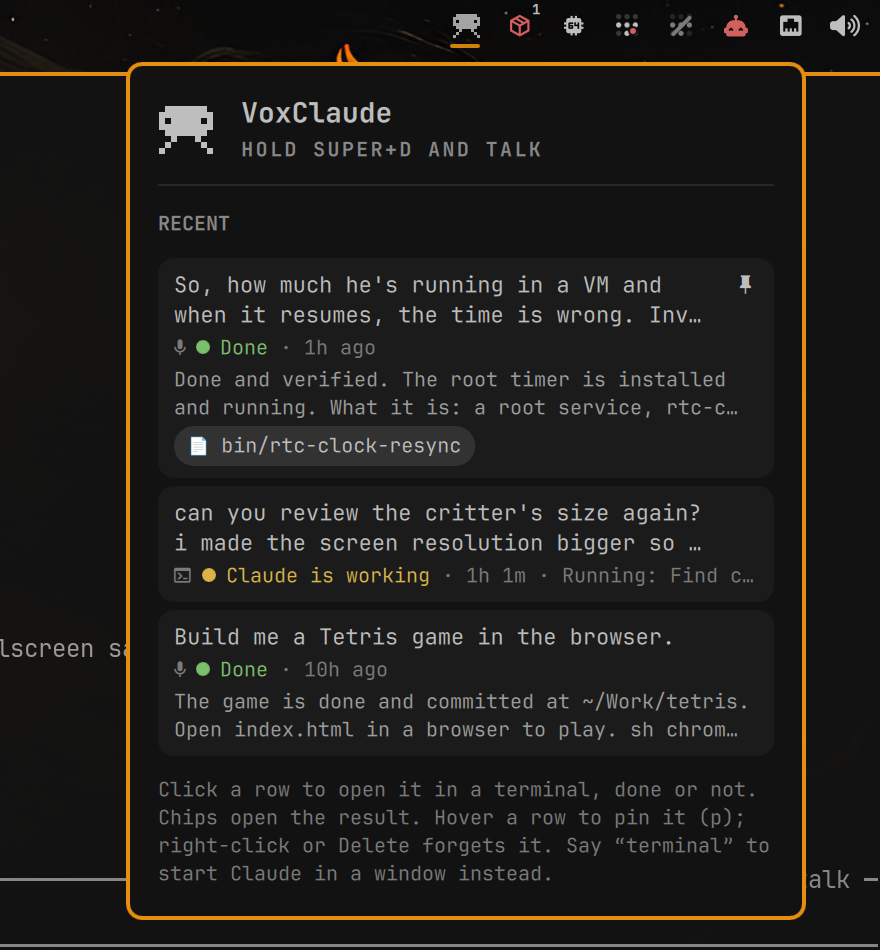

# VoxClaude

Hold a key, say what you want, let go. Claude Code does it in the background and
tells you when it is done. A terminal opens only when you ask for one ("open a
terminal and …") or when Claude needs you: a permission prompt, a question, a
tool asking for input. Either way the session itself runs in the background, so
closing that window leaves the work running and clicking the row picks it back
up.

Built for the [Omarchy](https://omarchy.org) shell on top of
[voxtype](https://github.com/peteonrails/voxtype) and the
[Claude Code](https://code.claude.com) CLI.

<p align="center"></p>

## What you get

- **Bar critter**: a pixel-art invader with Claude's eyes. It sits still when
  idle, blinks while listening, swings its arms and legs while Claude works,
  waves faster in the urgent colour when Claude needs you, and turns red when
  something failed. When a session finishes it blinks green three times over
  three seconds, so a finished task registers even if you missed the toast.
  Hover for the current prompt and step.
- **Popover** (left-click) with the recent voice sessions, needs-input first.
  Its hero is a second, larger critter: he blinks while listening, pulls a
  laptop out from behind his back and types while Claude works, and hops when
  Claude needs you.
  Each row carries a status dot and word: green when done, yellow while Claude
  is working or waiting on a background command it started (a build poll, a
  dev server), red when it needs you or something failed, grey when stopped.
  A finished session that wakes up again (a background task reporting back, or
  a follow-up you typed after attaching) goes back to yellow.
  Every row shows the prompt, then status · elapsed, then what Claude is doing
  right now on a line of its own (e.g. "Running: Install deps" or "Editing
  App.jsx"), the reply once done, and chips for anything the reply points at:
  URLs and files that exist. Click a row to open it in a terminal, done or not, so you can
  drop into a task or carry it on. Click a chip to open the result. Hovering a
  row reveals a pin: it keeps the row near the top, below anything waiting on
  you, and exempt from the 24-hour prune, and stays visible once set.
  Right-click (or Delete) hides a row. Keys: arrows move, Enter opens, `p`
  pins, Delete hides, `r` refreshes.
- **Toasts**: "Working on it" when a session starts, "Claude needs you" when a
  terminal was opened for you, and Claude's reply when it finishes; clicking
  the reply toast opens the result if there is one, otherwise the conversation.
- **A hint to Claude**: voice sessions get a short appended system prompt saying
  they were started from a widget the user cannot see, so replies stay short
  and end with where the result is when there is one. That line is what feeds
  the chips. When there is nothing to point at the reply says nothing about
  it, and a model that reports the absence anyway ("No file or URL for this
  one.") has that sentence dropped before it reaches a toast or a row.

## Requirements

- Omarchy 4 shell with voxtype installed and its daemon running
  (`systemctl --user status voxtype`). voxtype ≥ 1.0 is needed for
  `record start --file` and `record stop --wait`.
- Claude Code CLI ≥ 2.1.260 (`claude --bg`, `claude attach`, session-scoped hooks).
- `jq`, `flock` and `setsid` (util-linux), `pgrep` (procps), and `hyprctl`,
  `xdg-open` and Omarchy's own `omarchy-notification-send` and
  `omarchy-launch-tui`. All ship with Omarchy.

## Install

```bash
git clone https://github.com/NimbleAINinja/omarchy-voxclaude \
  ~/.config/omarchy/plugins/io.github.nimbleaininja.voxclaude
omarchy-shell shell rescanPlugins
```

Add the widget to the bar (Omarchy menu → Setup → Bar, or put
`{"id": "io.github.nimbleaininja.voxclaude"}` into a `bar.layout` section of
`~/.config/omarchy/shell.json`).

Then bind the key in `~/.config/hypr/bindings.lua`; the plugin cannot install
binds for you:

```lua
-- Hold Super+D to talk to Claude (VoxClaude plugin). Release D before Super.
local voxclaude = os.getenv("HOME") .. "/.config/omarchy/plugins/io.github.nimbleaininja.voxclaude/bin/voxclaude"
o.bind("SUPER + D", "Talk to Claude (hold)", voxclaude .. " start")
o.bind("SUPER + D", "Talk to Claude (release)", voxclaude .. " stop", { release = true })
```

Sessions opened from the widget or a toast run in their own terminal windows.
Make those float and centre, so they never open as a tile hidden behind a
floating (Super+T) or maximized window. Add to `~/.config/hypr/hyprland.lua`:

```lua
-- VoxClaude: sessions opened from the bar float on top of whatever you are doing.
o.window("org\\.omarchy\\.voxclaude.*", { float = true })
o.window("org\\.omarchy\\.voxclaude.*", { center = true })
o.window("org\\.omarchy\\.voxclaude.*", { size = { 1260, 850 } })  -- pixels; percentages are ignored here
```

`hyprctl reload`, then hold Super+D, talk, release. Plain voxtype dictation on
its own key keeps typing into the focused window; VoxClaude never changes the
voxtype config.

Bind a different key and the widget follows: its hint names the key you
actually bound, not the one above. `voxclaude keybind` is what resolves it —
from `hyprctl binds` when the bind carries its command, and from the files in
`~/.config/hypr` when Omarchy's Lua config compiles the command away behind a
`__lua` dispatcher. Bind nothing at all and the widget asks you to, rather
than naming a key that does nothing. The lookup runs when the shell starts and
again whenever the popover opens, so `hyprctl reload` is enough to correct it.

## Tracking every Claude session, not only voice ones

The widget turns out to be a good session tracker, so it can watch sessions
you start in a terminal too:

```bash
~/.config/omarchy/plugins/io.github.nimbleaininja.voxclaude/bin/voxclaude hooks install
```

That merges the same hooks into `~/.claude/settings.json` (a backup is kept
beside it; `hooks uninstall` removes only VoxClaude's entries, `hooks status`
says which). From then on every new Claude Code session gets a row once you
type something: the first prompt is the title, a session that never gets one
is not listed (unless it needs you, which is worth showing untitled), the row shows the same progress line, and the
status follows the session. Claude reloads its settings live, so sessions
already running pick the hooks up too; their row appears at their next tool
call, with the title filled in by the next prompt you type. `claude -p`
one-shots are ignored.

Terminal rows remember their window: clicking one focuses that window, or
resumes the conversation in a fresh floating terminal if the window is gone.
Toasts fire only when the window is not in front: "Claude needs you" (with the
window brought forward) and the reply when a turn finishes. A small glyph on
the status line marks terminal rows apart from voice ones.

## Settings

Set on the widget's entry in `shell.json` (or via the bar settings UI):

| key | default | meaning |
|---|---|---|
| `cwd` | `~/Work` | Directory the Claude session starts in |
| `permissionMode` | `auto` | `claude --permission-mode`; anything that would prompt opens a terminal instead |
| `terminalWords` | `terminal` | Comma-separated words that also open a terminal window on the session |
| `waitSeconds` | `60` | How long to wait for voxtype's transcript |

## How it works

```
Super+D down   voxclaude start     voxtype record start --file=$RT/prompt.txt
Super+D up     voxclaude stop      voxtype record stop --wait  →  transcript
                                   claude --bg --settings $RT/hooks.json -- "<text>"
                                   └─ said a terminal word → foot window: claude attach <shortId>
Claude hooks   SessionStart       → voxclaude hook start       → record + window for terminal sessions
               PreToolUse         → voxclaude hook tool        → progress line; done → busy again
               UserPromptSubmit   → voxclaude hook prompt      → new turn: done → busy again
               Notification (permission_prompt, agent_needs_input, elicitation_*)
                                   → voxclaude hook needs-input → terminal attached to the session
               Stop                → voxclaude hook stop        → reply, result chips, toast
               SessionEnd          → voxclaude hook end         → unanswered sessions marked stopped
```

`$RT` is `$XDG_RUNTIME_DIR/voxclaude`. It holds `status` (one word the widget
watches), `sessions/<shortId>.json` (one record per background session),
`sessions.json` (all records, newest first, rewritten on every change and
watched by the widget), `hooks.json` (the session-scoped Claude hooks) and
voxtype's `prompt.txt`.

A `PreToolUse` hook blocks the tool call that fired it, in every session on
the machine, so the script keeps that path cheap: four `jq` calls per hook
whatever the backlog. One reads the payload, one checks the record, one
updates it with the progress note computed inside the same filter, and one
sorts the whole set into the feed while deciding the bar word. The session's
Claude pid is remembered on the record instead of asked for (`claude agents
--json` costs a process launch), and a marker beside the records says which
sessions are not tracked: a `claude -p` one-shot or a forgotten row for good,
a session that could not be placed for a minute before it is tried again.

The two paths you can feel are kept short too. On the key press the
microphone opens before any housekeeping. On the release, once the transcript
is in, one `jq` reads every setting, and the record is written the moment
`claude --bg` returns: the session's uuid and pid arrive with its own
`SessionStart` hook about half a second later, so nothing between letting go
of the key and "Working on it" waits on the session listing.

Findings from the CLI this was built against (Claude Code 2.1.266):

- `claude --bg` ignores `--session-id`; the short id it prints is the first 8
  characters of the session UUID, which is what the hooks receive.
- Session-scoped hooks passed with `--settings` do fire inside background
  sessions. `AskUserQuestion` shows up as `permission_prompt`.
- `claude agents --json` reports `status` (`busy`, `waiting`, `idle`), `state`
  (`blocked`, `done`, `stopped`) and `waitingFor`; the widget does not depend
  on these because they are undocumented.

## Recovery and edge cases

- Let go of Super before D and the release bind never fires; recording keeps
  going. Press Super+D again: `start` notices the recording marker and stops.
- Closing a window VoxClaude opened never stops the work: every session it
  starts belongs to the Claude daemon, and the window is only a `claude attach`
  onto it ("The session keeps running either way", says `claude attach --help`).
  A session you started yourself in your own terminal is an ordinary
  interactive one and does end with its window.
- Nothing heard (voxtype exit 3) → quiet toast, back to idle.
- voxtype daemon down or Claude not logged in → error glyph plus a toast with
  the first line of stderr. `voxclaude status` prints the current word.
- Records older than a day are pruned (with their lock files), both after the
  microphone opens when you hold the key and, at most once an hour, from the
  hooks themselves, so a machine that only tracks terminal sessions does not
  pile them up. The bar status is recomputed from the records on every hook,
  so a lost notification cannot wedge the glyph.
- Hiding a row takes it out of the list and nothing else: the session keeps
  running, and because it keeps its record it never returns untitled. The
  day-old prune clears it in the end, like any other row. One exception: a
  hidden session that ends up needing you is listed again, because waiting out
  of sight for someone who cannot see it is worse than an unwanted row.
- Clicking a row seems to do nothing: the attach window opened as a tile
  behind your floating or maximized terminal. Add the window rules from the
  Install section.
- If your home directory path contains spaces, the hook commands in
  `hooks.json` need quoting; open an issue.

## Removing it

VoxClaude puts three things outside its own directory: hooks in
`~/.claude/settings.json` if you ran `hooks install`, a widget entry in
`shell.json`, and the binds and window rules in your Hyprland config. Run this
first, while the plugin is still there:

```bash
~/.config/omarchy/plugins/io.github.nimbleaininja.voxclaude/bin/voxclaude uninstall
```

It takes its own hooks back out of `~/.claude/settings.json`, leaving anything
else in there untouched, and clears the runtime state. That has to happen
before the directory goes: those hooks name the script by absolute path, and
left behind they would make every Claude Code session on the machine run a
command that is not there, once per tool call.

It then prints the lines to delete from your own config files, with line
numbers, and leaves them to you:

- the `io.github.nimbleaininja.voxclaude` entry in a `bar.layout` section of
  `~/.config/omarchy/shell.json` (or Omarchy menu → Setup → Bar)
- the two `o.bind` lines in `~/.config/hypr/bindings.lua`
- the three `o.window` rules for `org.omarchy.voxclaude` in
  `~/.config/hypr/hyprland.lua`

Then remove the plugin and reload:

```bash
omarchy plugin remove io.github.nimbleaininja.voxclaude   # or: rm -rf the directory
hyprctl reload && omarchy restart shell
```

Nothing else is left: session records live only in `$XDG_RUNTIME_DIR`, and
voxtype is never reconfigured, so plain dictation on its own key is unaffected.

## Development

```bash
tests/run          # manifest, node unit tests, bash stub tests, QML tests, qmllint
omarchy restart shell   # plugin QML does not hot-reload on Omarchy 4
omarchy-shell io.github.nimbleaininja.voxclaude toggle
omarchy-shell io.github.nimbleaininja.voxclaude status
bin/voxclaude dispatch "reply with pong"   # exercise the pipeline without a microphone
bin/voxclaude list | jq                    # the session records
bin/voxclaude keybind                      # the hold key the widget will name
```

Note: the pixel renderer is `PixelSprite.qml`, not `Sprite.qml`; QtQuick has a
built-in `Sprite` type that shadows a same-named file.

`Model.js` is pure ES5 shared by QML and node. `bin/voxclaude` is the only
thing that runs processes; `tests/voxclaude.test.sh` drives it with stub
`voxtype`, `claude` and `omarchy-*` binaries on `PATH`.

## License

MIT
